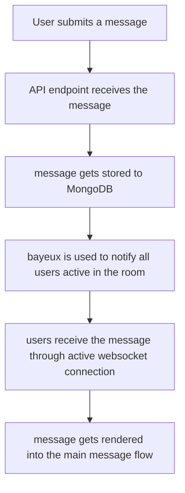
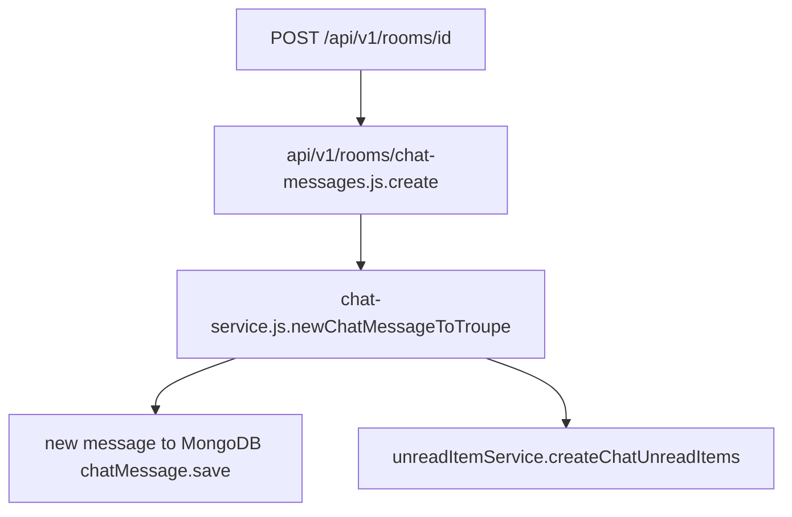
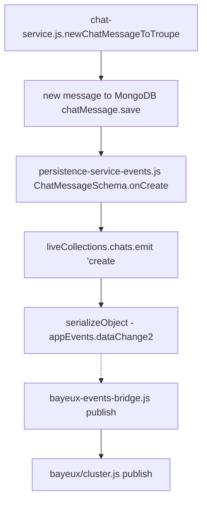

# Sending and receiving messages explained
This document will walk you through the implementation of sending and receiving messages end to end.



## User typed in a message and pressed `Enter`
1. [ChatInputBoxView.send](https://gitlab.com/gitlab-org/gitter/webapp/blob/49cc5b37f6691e500dcb23b9dc57fd338ef1a02d/public/js/views/chat/chat-input-box-view.js#L248) adds the new message to `LiveCollection`.
    - This collection is available from [`router-chat.js`](https://gitlab.com/gitlab-org/gitter/webapp/blob/49cc5b37f6691e500dcb23b9dc57fd338ef1a02d/public/js/router-chat.js#L260) through [`ChatToolbarInput`](https://gitlab.com/gitlab-org/gitter/webapp/blob/49cc5b37f6691e500dcb23b9dc57fd338ef1a02d/public/js/views/layouts/chat-toolbar-input.js#L109)
1. We use `backbone-proxy-collection` [wrapped by `chats-cached` collection](https://gitlab.com/gitlab-org/gitter/webapp/blob/49cc5b37f6691e500dcb23b9dc57fd338ef1a02d/public/js/collections/instances/chats-cached.js#L30). This proxy collection uses [`ChatCollection`](https://gitlab.com/gitlab-org/gitter/webapp/blob/49cc5b37f6691e500dcb23b9dc57fd338ef1a02d/public/js/collections/chat.js#L89) to define how the `LiveCollection` fetches data.
1. Thanks to this [`urlTemplate` set to `/v1/rooms/:troupeId/chatMessages`](https://gitlab.com/gitlab-org/gitter/webapp/blob/49cc5b37f6691e500dcb23b9dc57fd338ef1a02d/public/js/collections/chat.js#L96) we send a POST request to API when [something is created in the chat collection](https://gitlab.com/gitlab-org/gitter/webapp/blob/fc20892381b2c23a0937d19329ea35a11282541e/public/js/views/chat/chat-input-box-view.js#L248).


## API listens for POST requests on `/v1/rooms/:troupeId/chatMessages`

1. [`server/api/v1/rooms/chat-messages.js`](https://gitlab.com/gitlab-org/gitter/webapp/blob/7984c4966f8322a319172400561f064372ff013c/server/api/v1/rooms/chat-messages.js) handles creation of the new message. The API folder structure copies the URL.
1. POST request invokes `create` method which [calls `chatService.newChatMessageToTroupe()`](https://gitlab.com/gitlab-org/gitter/webapp/blob/7984c4966f8322a319172400561f064372ff013c/server/api/v1/rooms/chat-messages.js#L85).
1. `chatService` [saves the newly created message](https://gitlab.com/gitlab-org/gitter/webapp/blob/c4387f141ced8272cb6eb5731d19adb84d74d7bf/modules/chats/lib/chat-service.js#L191) to MongoDB.
    <details>
    <summary>Example of stored message</summary>

    ```json
    {
        "_id": ObjectID("5d147ea84dad9dfbc522317a"),
        "fromUserId": ObjectID("5cdc09f6572f607a5bc8a41d"),
        "toTroupeId": ObjectID("5d07443a17d82eff1cc8265e"),
        "text": "Example message using a bit of  `code` and **bold** to show how *markdown* is stored.",
        "pub": true,
        "html": "Example message using a bit of  <code>code</code> and <strong>bold</strong> to show how <em>markdown</em> is stored.",
        "lang": "en",
        "_md": 14,
        "_tv": 1,
        "readBy": [],
        "editedAt": null,
        "sent": ISODate("2019-06-27T08:30:32.165Z"),
        "issues": [],
        "mentions": [],
        "urls": [],
        "__v": 0
    }
    ```
  </details>

1. `chatService` [uses `unreadItemService` to `createChatUnreadItems`](https://gitlab.com/gitlab-org/gitter/webapp/blob/c4387f141ced8272cb6eb5731d19adb84d74d7bf/modules/chats/lib/chat-service.js#L209).

## Distribute a message to active users

1. `persistence-service-events` [adds a new listener on created chat message](https://gitlab.com/gitlab-org/gitter/webapp/blob/c4387f141ced8272cb6eb5731d19adb84d74d7bf/server/services/persistence-service-events.js#L27) during application startup.
1. `live-collection-chat` [emits `dataChange2` with the new message](https://gitlab.com/gitlab-org/gitter/webapp/blob/c4387f141ced8272cb6eb5731d19adb84d74d7bf/server/services/live-collection-handlers/live-collection-chats.js#L18).
1. `bayeux-events-bridge` listens on `dataChange2` and [publishes the message to a bayeux cluster](https://gitlab.com/gitlab-org/gitter/webapp/blob/c4387f141ced8272cb6eb5731d19adb84d74d7bf/server/event-listeners/bayeux-events-bridge.js#L52).
1. `bayeux/cluster` [publishes the message](https://gitlab.com/gitlab-org/gitter/webapp/blob/c4387f141ced8272cb6eb5731d19adb84d74d7bf/server/web/bayeux/cluster.js#L265) (internally it's using `redis-faye` to store the message to redis).

## Users subscribing to `chatMessages` channel.
There are multiple ways of listening to new messages in a room.
- Bayeux protocol over websockets - main mean of the message transport, the only option discussed here
- long-polling used as a fallback

1. The [realtime-client uses](https://gitlab.com/gitlab-org/gitter/realtime-client/blob/9c11abd8a1206b712272a99aed49c95f1cb10471/lib/realtime-client.js#L308) [`gitter/halley`](https://gitlab.com/gitlab-org/gitter/halley) client to subscribe to [`/bayeux` endpoint](https://gitlab.com/gitlab-org/gitter/realtime-client/blob/9c11abd8a1206b712272a99aed49c95f1cb10471/lib/realtime-client.js#L21).
1. webapp [initializes a `chats` `LiveCollections`](https://gitlab.com/gitlab-org/gitter/webapp/blob/0a4c1c39acf1efdcaa8f8bd452f15cfe939ff5dc/public/js/collections/chat.js#L96).
1. `ChatCollection` [listens on new messages](https://gitlab.com/gitlab-org/gitter/webapp/blob/c30893e683bef21634f5a084d8b372f88be9165a/public/js/collections/chat.js#L112).
1. `ChatCollection` (wrapped in cache) is [used as the main model for the chat window in `router-chat`](https://gitlab.com/gitlab-org/gitter/webapp/blob/c30893e683bef21634f5a084d8b372f88be9165a/public/js/router-chat.js#L72).

## UI displaying a new message
- The `ChatCollection` extends `realtime-client.LiveCollection` which in turn [extends `Backbone.Collection`](https://gitlab.com/gitlab-org/gitter/realtime-client/blob/9c11abd8a1206b712272a99aed49c95f1cb10471/lib/live-collection.js#L17).
- `ChatCollectionView` is responsible for rendering the chat messages feed. [It extends Marionette.CollectionView](https://gitlab.com/gitlab-org/gitter/webapp/blob/f20b8a678938c3d0f306c74293eac3621ef513b4/public/js/views/chat/chatCollectionView.js#L115) which [connects to the `Backbone.Collection` life cycle](https://marionettejs.com/docs/marionette.collectionview.html#marionettecollectionview).
- [`ChatCollectionView` specifies `ChatItemView` as a view for one message](https://gitlab.com/gitlab-org/gitter/webapp/blob/f20b8a678938c3d0f306c74293eac3621ef513b4/public/js/views/chat/chatCollectionView.js#L135).
- [`ChatItemView`](https://gitlab.com/gitlab-org/gitter/webapp/blob/f20b8a678938c3d0f306c74293eac3621ef513b4/public/js/views/chat/chatItemView.js) is a juicy view that supports all use cases of one displayed message.
- You can find the template for `ChatItemView` in [`chatItemView.hbs`](https://gitlab.com/gitlab-org/gitter/webapp/blob/f20b8a678938c3d0f306c74293eac3621ef513b4/public/js/views/chat/tmpl/chatItemView.hbs).