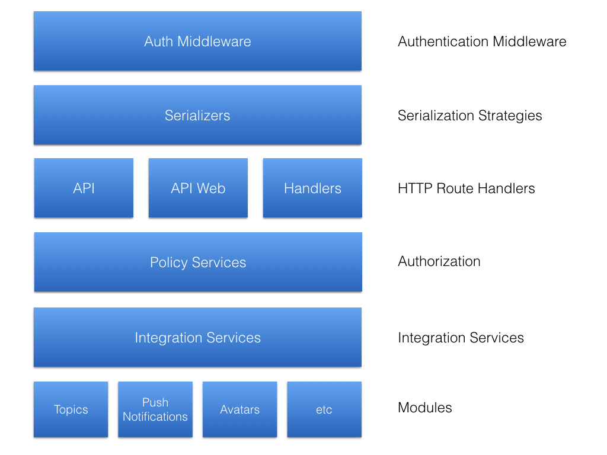

# Server

* [`api`](./api): API HTTP Routes
* [`api-web`](./api-web): `api_web` HTTP Routes
* [`event-listeners`](./event-listeners): Event-bus Listeners
* [`gateways`](./gateways): Gateways for mobile services
* [`handlers`](./handlers): gitter.im HTTP Routes
* [`serializers`](./serializers): JSON Serialization Strategies
* [`services`](./services): Integration services and policy services
* [`utils`](./utils): Utilities
* [`web`](./web): Web utilities
* [`workers`](./workers): **Resque workers**

### The Gitter Rendering and API layer

